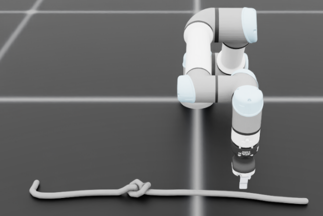

# Isaac Lab Rope Knot environment

## Overview


This repository contains an manager based environment for Isaac Sim/Lab, which features a rope made from capsules.
An UR5e with a Robotiq Hand-E shall create a knot using the rope.
The rope will be created using a spawner function. Its position will be slightly randomized as well as its shape.

## Installation

- Install Isaac Lab by following the [installation guide](https://isaac-sim.github.io/IsaacLab/main/source/setup/installation/index.html).
  We recommend using the conda or uv installation as it simplifies calling Python scripts from the terminal.

- Clone or copy this project/repository separately from the Isaac Lab installation (i.e. outside the `IsaacLab` directory):

- Using a python interpreter that has Isaac Lab installed, install the library in editable mode using:

    ```bash
    # use 'PATH_TO_isaaclab.sh|bat -p' instead of 'python' if Isaac Lab is not installed in Python venv or conda
    python -m pip install -e source/RopeKnot

- Verify that the extension is correctly installed by:

    - Listing the available tasks:
        ```bash
        # use 'FULL_PATH_TO_isaaclab.sh|bat -p' instead of 'python' if Isaac Lab is not installed in Python venv or conda
        python scripts/list_envs.py
        ```
        Should show a table with an entry `STUBA-Ropeknot-v0`. This is the name of the task.

    - Run teleoperation script:

        ```bash
        # use 'FULL_PATH_TO_isaaclab.sh|bat -p' instead of 'python' if Isaac Lab is not installed in Python venv or conda
        python scripts/teleop_se3_agent.py --task=STUBA-Ropeknot-v0
        ```

    - Record via teleoperation:

        ```bash
        # use 'FULL_PATH_TO_isaaclab.sh|bat -p' instead of 'python' if Isaac Lab is not installed in Python venv or conda
        python scripts/record_demos.py --task=STUBA-Ropeknot-v0 --num_demos 1
        ```
        Press P to mark the demo as successful.


    - Replay recorded demos:

        ```bash
        # use 'FULL_PATH_TO_isaaclab.sh|bat -p' instead of 'python' if Isaac Lab is not installed in Python venv or conda
        python scripts/replay_demos.py --task=STUBA-Ropeknot-v0 --dataset_file=datasets/test-dataset.hdf5
        ```


    - Running a task:

        ```bash
        # use 'FULL_PATH_TO_isaaclab.sh|bat -p' instead of 'python' if Isaac Lab is not installed in Python venv or conda
        python scripts/<RL_LIBRARY>/train.py --task=STUBA-Ropeknot-v0
        ```

    - Running a task with dummy agents:

        These include dummy agents that output zero or random agents. They are useful to ensure that the environments are configured correctly.

        - Zero-action agent

            ```bash
            # use 'FULL_PATH_TO_isaaclab.sh|bat -p' instead of 'python' if Isaac Lab is not installed in Python venv or conda
            python scripts/zero_agent.py --task=STUBA-Ropeknot-v0
            ```
        - Random-action agent

            ```bash
            # use 'FULL_PATH_TO_isaaclab.sh|bat -p' instead of 'python' if Isaac Lab is not installed in Python venv or conda
            python scripts/random_agent.py --task=STUBA-Ropeknot-v0
            ```

### Set up IDE (Optional)

To setup the IDE, please follow these instructions:

- Run VSCode Tasks, by pressing `Ctrl+Shift+P`, selecting `Tasks: Run Task` and running the `setup_python_env` in the drop down menu.
  When running this task, you will be prompted to add the absolute path to your Isaac Sim installation.

If everything executes correctly, it should create a file .python.env in the `.vscode` directory.
The file contains the python paths to all the extensions provided by Isaac Sim and Omniverse.
This helps in indexing all the python modules for intelligent suggestions while writing code.

### Setup as Omniverse Extension (Optional)

We provide an example UI extension that will load upon enabling your extension defined in `source/RopeKnot/RopeKnot/ui_extension_example.py`.

To enable your extension, follow these steps:

1. **Add the search path of this project/repository** to the extension manager:
    - Navigate to the extension manager using `Window` -> `Extensions`.
    - Click on the **Hamburger Icon**, then go to `Settings`.
    - In the `Extension Search Paths`, enter the absolute path to the `source` directory of this project/repository.
    - If not already present, in the `Extension Search Paths`, enter the path that leads to Isaac Lab's extension directory directory (`IsaacLab/source`)
    - Click on the **Hamburger Icon**, then click `Refresh`.

2. **Search and enable your extension**:
    - Find your extension under the `Third Party` category.
    - Toggle it to enable your extension.

## Code formatting

We have a pre-commit template to automatically format your code.
To install pre-commit:

```bash
pip install pre-commit
```

Then you can run pre-commit with:

```bash
pre-commit run --all-files
```

## Troubleshooting

### Pylance Missing Indexing of Extensions

In some VsCode versions, the indexing of part of the extensions is missing.
In this case, add the path to your extension in `.vscode/settings.json` under the key `"python.analysis.extraPaths"`.

```json
{
    "python.analysis.extraPaths": [
        "<path-to-ext-repo>/source/RopeKnot"
    ]
}
```

### Pylance Crash

If you encounter a crash in `pylance`, it is probable that too many files are indexed and you run out of memory.
A possible solution is to exclude some of omniverse packages that are not used in your project.
To do so, modify `.vscode/settings.json` and comment out packages under the key `"python.analysis.extraPaths"`
Some examples of packages that can likely be excluded are:

```json
"<path-to-isaac-sim>/extscache/omni.anim.*"         // Animation packages
"<path-to-isaac-sim>/extscache/omni.kit.*"          // Kit UI tools
"<path-to-isaac-sim>/extscache/omni.graph.*"        // Graph UI tools
"<path-to-isaac-sim>/extscache/omni.services.*"     // Services tools
...
```